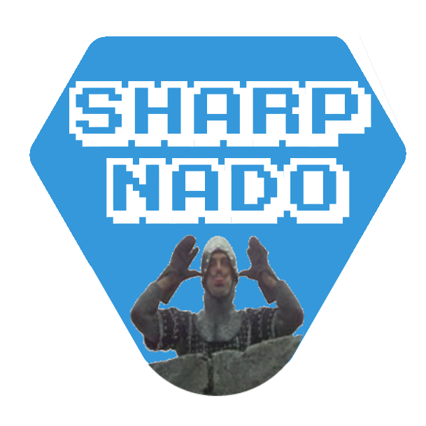
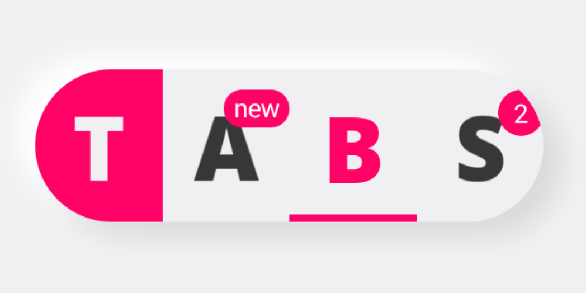
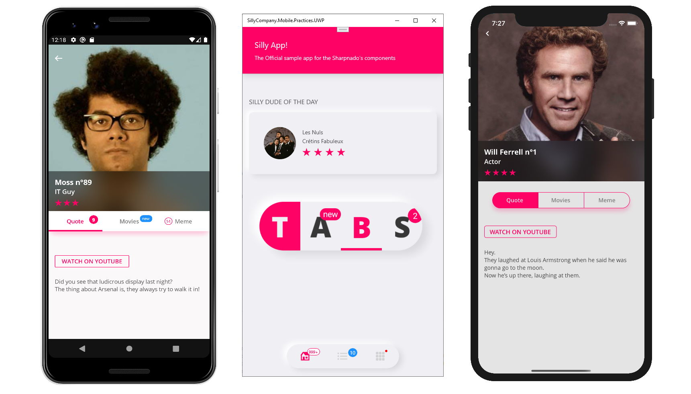
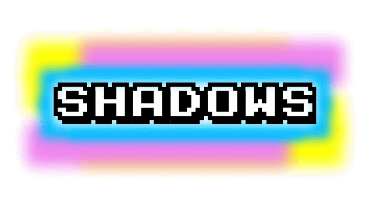
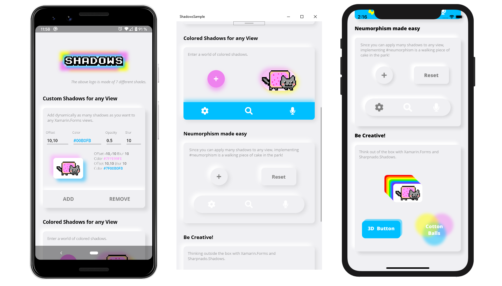
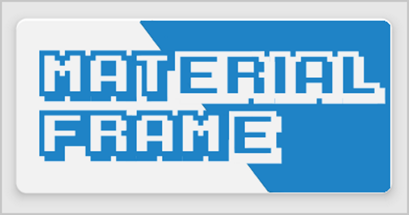
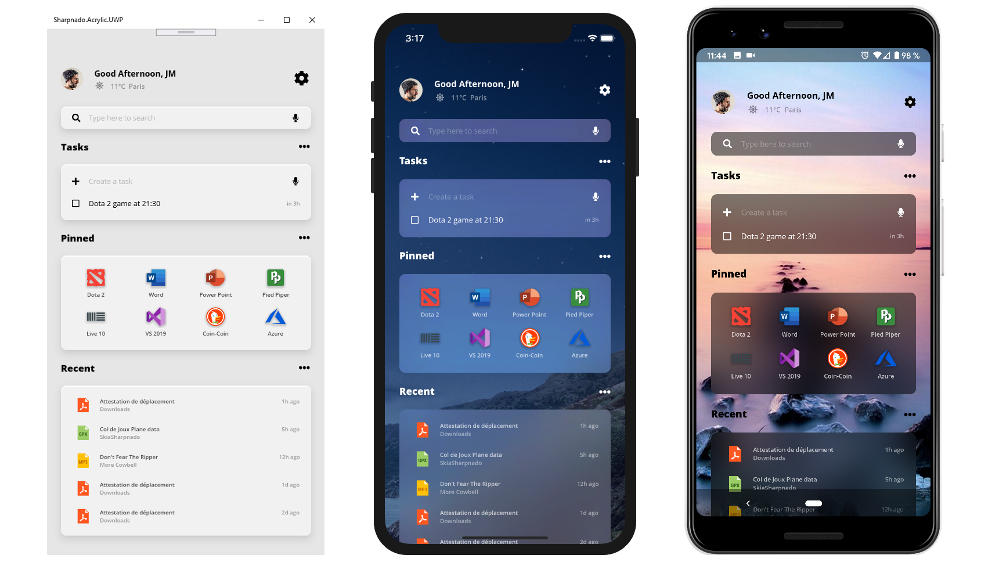
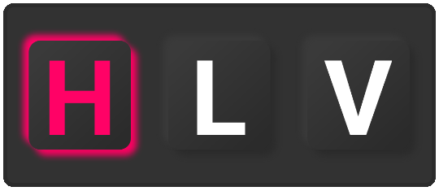
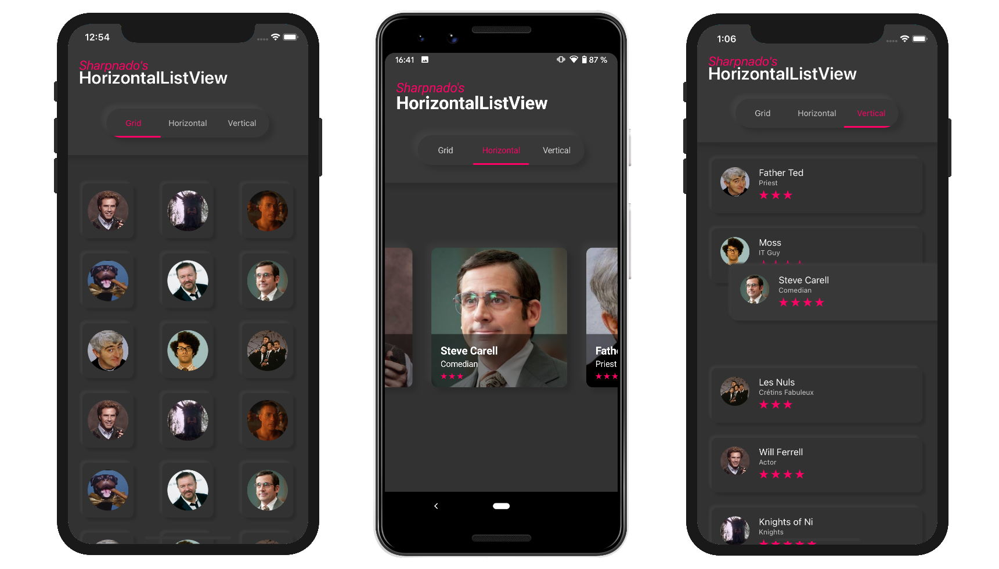

# Sharpnado.Presentation.Forms

|Logo| Library name | Version                                                                                                                             |
| -- | -------- | ---------------------------------------------------------------------------------------------------------------------------------------- |
|  | Sharpnado.Presentation.Forms  |  |

Latest version of Sharpnado.Presentation.Forms (v1.7.1) **doesn't have all the sharpnado nugets up to date**.

The preferred way of using packages is now to **install only the one needed individually**.

## MUST READ: Big refactoring ?

The big sharpnado refactoring is over.

Each sharpnado's component has now its own repo.

* `Sharpnado.Tabs` have now [their own repo](https://github.com/roubachof/Sharpnado.Tabs)
* `Sharpnado.HorizontalListView` have now [its own repo](https://github.com/roubachof/Sharpnado.HorizontalListView)
* The `Sharpnado.Presentation.Forms` repo is now only a Home page for all the Sharpnado's component.

Latest version of Sharpnado.Presentation.Forms (v1.7.1) doesn't have all the sharpnado nugets up to date.

Version 1.8 will include latest components and won't require initialization code.

Preferred way of using packages is now to install only the one needed.

## Sample App: the Silly! app

All the following components are presented in the Silly! app in the following repository:

https://github.com/roubachof/Xamarin-Forms-Practices

If you want to know how to use the components, it's the best place to start.

## Initialization

**IMPORTANT:** On platform projects, call `SharpnadoInitializer.Initialize()` after `Xamarin.Forms.Forms.Init()` and before `LoadApplication(new App())`.


## Featured Components 

Xamarin Forms custom components and renderers starring:

### [``Sharpnado.Tabs``](https://github.com/roubachof/Sharpnado.Tabs)



* Fully customizable
* Underlined tabs, bottom tabs, Segmented control, scrollable tabs
* BadgeView
* Component oriented architecture
* Layout your tabs and ```ViewSwitcher``` as you want
* Shadows included in `TabHost`
* Bindable



### [``Sharpnado.Shadows``](https://github.com/roubachof/Sharpnado.Shadows)



* Add as **many** **custom** shadows as you like to any `Xamarin.Forms` view (`Android`, `iOS`, `UWP`). 
* You can specify each shadow `Color`, `Opacity`, `BlurRadius`, and `Offset`
* Simply implement `Neumorphism`
* You can add one shadow, 3 shadows, 99 shadows, to any `Xamarin.Forms` element
* Animate any of these property and make the shadows dance around your elements
* No `AndroidX` or `SkiaSharp` dependency required, only `Xamarin.Forms`



### [``Sharpnado.MaterialFrame``](https://github.com/roubachof/Sharpnado.MaterialFrame)



  * 4 built-in themes: AcrylicBlur/Acrylic/Dark/Light
  * 3 Blur Styles: Light/ExtraLight/Dark
  * Based on `RealtimeBlurView` on Android and `UIVisualEffectView` on iOS
  * Dark elevation
  * LightBackground color
  * CornerRadius
  * Performance




### [```HorizontalListView``` for Xamarin Forms](https://github.com/roubachof/Sharpnado.HorizontalListView)



  * Horizontal, Grid, Carousel or Vertical layout
  * Reveal custom animations
  * Drag and Drop feature
  * Column count
  * Infinite loading with ```Paginator``` component
  * Snapping on first or middle element
  * Padding and item spacing
  * Handles ```NotifyCollectionChangedAction``` Add, Remove and Reset actions
  * View recycling
  * ```RecyclerView``` on Android
  * ```UICollectionView``` on iOS



### [```Sharpnado.TaskLoaderView 2.0``` handles all your task loading states](https://github.com/roubachof/Sharpnado.TaskLoaderView)


  * Handles error with custom messages and icons
  * Handles empty states
  * Show snackbar errors for refresh scenarios (if data is already shown)
  * Handles retry with button
  * Support Xamarin.Forms.Skeleton
  * Can override any state views with your own custom ones

<p float="left" align="middle">
  
  
</p>

**IMPORTANT:** On platform projects, call SharpnadoInitializer.Initialize() after Xamarin.Forms.Forms.Init() and before LoadApplication(new App()).

Those components are used and tested in the Silly! app:  https://github.com/roubachof/Xamarin-Forms-Practices.

## Open Source licenses and inspirations

* Special thanks to Daniel John Causer (https://causerexception.com) for inspiring the horizontal list.
* Thanks to alex dunn for his ```MaterialFrame``` idea.
* Thanks to Vladislav Zhukov (https://github.com/mrxten/XamEffects) for its ```TapCommand``` and ```TouchFeedbackColor``` effects, Copyright (c) 2017 Vladislav Zhukov, under MIT License (MIT).
* I greet his grace Stephen Cleary (https://github.com/StephenCleary) who cast his holy words on my async soul (https://www.youtube.com/watch?v=jjaqrPpdQYc). ```NotifyTask``` original code, Copyright (c) 2015 Stephen Cleary, under MIT License (MIT).
