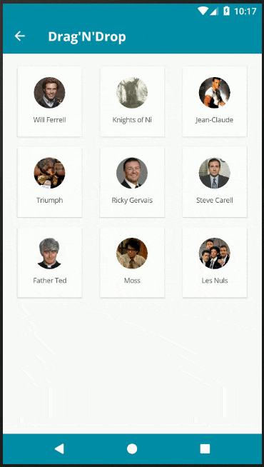
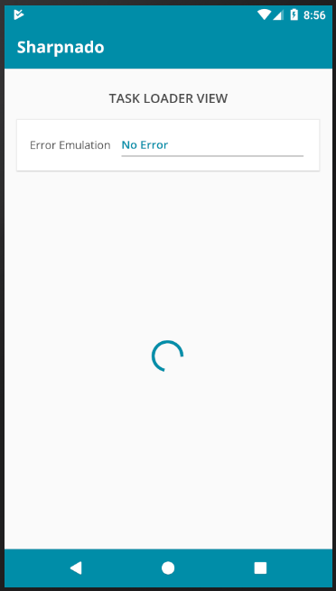
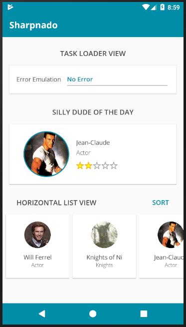
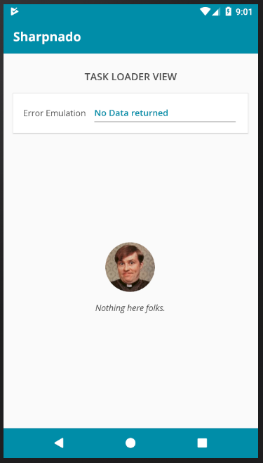
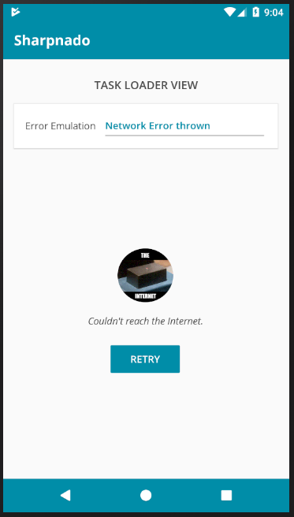

# Sharpnado.Presentation.Forms

| Platform | Build Status                                                                                                                             |
| -------- | ---------------------------------------------------------------------------------------------------------------------------------------- |
| Android  | [](https://appcenter.ms) |
| iOS      | [](https://appcenter.ms) |

Xamarin Forms custom components and renderers including:

```HorizontalListView``` for Xamarin Forms:
  * Carousel layout
  * Column count
  * Infinite loading with ```Paginator``` component
  * Snapping on first or middle element
  * Padding and item spacing
  * Handles ```NotifyCollectionChangedAction``` Add, Remove and Reset actions
  * View recycling
  * ```RecyclerView``` on Android
  * ```UICollectionView``` on iOS
  * This implementation is in fact very close in terms of philosophy and implementation to what will provide the future Xamarin ```CollectionView```.

<p float="left" align="middle">
  
  
</p>

```Grid``` collection view (```HorizontalListView``` with ```ListLayout``` set to ```Grid```):
  * Column count (if equal to 1 then you have a classic ```ListView``` ;)
  * Infinite loading with ```Paginator``` component
  * Drag and Drop
  * Padding and item spacing
  * Handles ```NotifyCollectionChangedAction``` Add, Remove and Reset actions
  * View recycling

<p float="left" align="middle">
  
  
</p>

```TaskLoaderView``` displays an ```ActivityLoader``` while loading then:
  * Handles error with custom messages and icons
  * Handles empty states
  * Don't show activity loader for refresh scenarios (if data is already shown)
  * Handles retry with button
  * Pure Xamarin Forms view: no renderers

<p align="center">
  
</p>


It's available in 2 Nuget flavors:

* **Sharpnado.Presentation.Forms** (which include several others components like the increeeedible ```TaskLoaderView```)
* **Sharpnado.Forms.HorizontalListView** (```HorizontalListView``` only with only ```TapCommand``` and ```MaterialFrame```)

**IMPORTANT:** On platform projects, call SharpnadoInitializer.Initialize() after Xamarin.Forms.Forms.Init() and before LoadApplication(new App()).


Those components are used and tested in the Silly! app:  https://github.com/roubachof/Xamarin-Forms-Practices.

## HorizontalListView (and Grid mode)

You can find the blog post on www.sharpnado.com/a-real-horizontal-list-view/.

### Linear layout

```csharp
public HorizontalListViewLayout ListLayout { get; set; } = HorizontalListViewLayout.Linear;
```
By default the layout is in ```Linear``` mode, which means you will have only one row.
You can specify the ```ItemWidth``` and ```ItemHeight```.
You can also specify ```ItemSpacing``` and ```CollectionPadding```.


```xml
<renderedViews:HorizontalListView Grid.Row="3"
                                  Margin="-16,8"
                                  CollectionPadding="8,8"
                                  ItemSpacing="8"
                                  ItemHeight="144"
                                  ItemWidth="144"
                                  ItemsSource="{Binding SillyPeopleLoader.Result}"
                                  SnapStyle="Center">
    <renderedViews:HorizontalListView.ItemTemplate>
        <DataTemplate>
            <ViewCell>
                <views:SillySquareCell effects:TapCommandEffect.Tap="{Binding OnItemTappedCommand}"
                                       effects:TapCommandEffect.TapParameter="{Binding .}"
                                       effects:ViewEffect.TouchFeedbackColor="{StaticResource Accent}" />
            </ViewCell>
        </DataTemplate>
    </renderedViews:HorizontalListView.ItemTemplate>
</renderedViews:HorizontalListView>
```

<p align="center">
  A <code>HorizontalListView</code> with <code>SnapStyle=Center</code> and <code>ItemWidth/ItemHeight</code> set.
</p>
<p align="center">
  
</p>

As you can see ```TapCommand``` and ```TouchFeedbackColor``` (aka Ripple) are brought to you by the awesome effects created by mrxten (https://github.com/mrxten/XamEffects). The class effects are directly integrated in the Sharpnado projects so you don't have to reference another nuget package.

#### ColumnCount property

You can also decide to just specify the number of column you want, the ```ColumnCount``` property, and the ```ItemWidth``` will be computed for you.

```xml
<renderedViews:HorizontalListView Grid.Row="3"
                                  Margin="-16,8"
                                  CollectionPadding="8,8"
                                  ItemSpacing="8"
                                  ColumnCount="2"
                                  ItemsSource="{Binding SillyPeopleLoader.Result}"
                                  SnapStyle="Start">
    ...
</renderedViews:HorizontalListView>
```

<p align="center">
  A <code>HorizontalListView</code> with <code>ColumnCount=2</code>.
</p>
<p align="center">
  
</p>

#### Carousel Layout

You can set ```ListLayout``` to ```Carousel```.
In this mode you can't specify ```ItemWidth``` (obviously).
If you don't specify the ```ItemHeight```, it will be automatically computed for you.

```xml
<renderedViews:HorizontalListView Grid.Row="3"
                                  Margin="-16,8"
                                  CollectionPadding="8,8"
                                  ItemSpacing="8"
                                  ListLayout="Carousel"
                                  ItemsSource="{Binding SillyPeopleLoader.Result}"
                                  SnapStyle="Center">
    ...
</renderedViews:HorizontalListView>
```

<p align="center">
  A <code>HorizontalListView</code> with <code>ListLayout=Carousel</code>.
</p>
<p align="center">
  
</p>

### Grid Layout

If you set the ```ListLayout``` property to ```Grid```, you will have access to the same properties.

```xml
<renderedViews:HorizontalListView CollectionPadding="16"
                                  ItemSpacing="8"
                                  EnableDragAndDrop="True"
                                  ItemWidth="110"
                                  ItemHeight="120"
                                  ItemsSource="{Binding SillyPeople}"
                                  ListLayout="Grid">
    <renderedViews:HorizontalListView.ItemTemplate>
        <DataTemplate>
            <renderedViews:DraggableViewCell x:Name="DraggableViewCell">
                <ContentView>
                    <renderedViews:MaterialFrame Margin="4"
                                                 Padding="{StaticResource StandardThickness}"
                                                 Elevation="4">

                        <Frame.Triggers>
                            <DataTrigger Binding="{Binding Source={x:Reference DraggableViewCell}, Path=IsDragAndDropping}"
                                         TargetType="renderedViews:MaterialFrame"
                                         Value="True">
                                <Setter Property="Elevation" Value="8" />
                            </DataTrigger>
                        </Frame.Triggers>

                        <Grid ColumnSpacing="0" RowSpacing="0">
                            <Grid.RowDefinitions>
                                <RowDefinition Height="2*" />
                                <RowDefinition Height="*" />
                            </Grid.RowDefinitions>
                            <abstractions:CircleImage Grid.Row="0"
                                                      Style="{StaticResource SmallAvatar}"
                                                      Aspect="AspectFill"
                                                      Source="{Binding ImageUrl}" />
                            <Label Grid.Row="1"
                                   Margin="{StaticResource MediumTopThickness}"
                                   Style="{StaticResource TextSmallCaption}"
                                   HorizontalTextAlignment="Center"
                                   Text="{Binding Name}" />
                        </Grid>
                    </renderedViews:MaterialFrame>
                </ContentView>
            </renderedViews:DraggableViewCell>
        </DataTemplate>
    </renderedViews:HorizontalListView.ItemTemplate>
</renderedViews:HorizontalListView>
```

The nuget package comes also with a ```MaterialFrame``` view with ```Elevation``` property. Some code has been taken from [Alex Dunn work](https://alexdunn.org/2018/06/06/xamarin-tip-dynamic-elevation-frames/).

<p align="center">
A <code>Grid</code> <code>ListLayout</code> with padding and item spacing.<br>
</p>
<p align="center">
  
</p>

You can use the ```IsDragAndDropping``` property of the ```DraggableViewCell``` to achieve an Elevation effect while dragging your view with a simple ```DataTrigger```.

#### ColumnCount property

The ```ColumnCount``` property works also with the grid layout.

```xml
<renderedViews:HorizontalListView CollectionPadding="8"
                                  ItemSpacing="8"
                                  EnableDragAndDrop="True"
                                  ColumnCount="1"
                                  ItemHeight="120"
                                  ItemsSource="{Binding SillyPeople}"
                                  ListLayout="Grid">
```

<p align="center">
A <code>Grid</code> <code>ListLayout</code> with <code>ColumnCount=1</code>.
</p>
<p align="center">
  
</p>

### Infinite Loading

You can achieve infinite loading really easily by using the ```Paginator``` component, and bind it to the ```InfiniteListLoader``` property.
All is explained here:

https://www.sharpnado.com/paginator-platform-independent/

### Others properties

#### Properties available with both layout mode

```csharp
public static readonly BindableProperty ItemsSourceProperty = BindableProperty.Create(
    nameof(ItemsSource),
    typeof(IEnumerable),
    typeof(HorizontalListView),
    default(IEnumerable<object>),
    BindingMode.TwoWay);

public static readonly BindableProperty InfiniteListLoaderProperty = BindableProperty.Create(
    nameof(ItemsSource),
    typeof(IInfiniteListLoader),
    typeof(HorizontalListView));

public static readonly BindableProperty ScrollBeganCommandProperty = BindableProperty.Create(
    nameof(ScrollBeganCommand),
    typeof(ICommand),
    typeof(HorizontalListView));

public static readonly BindableProperty ScrollEndedCommandProperty = BindableProperty.Create(
    nameof(ScrollEndedCommand),
    typeof(ICommand),
    typeof(HorizontalListView));

public static readonly BindableProperty CurrentIndexProperty = BindableProperty.Create(
    nameof(CurrentIndex),
    typeof(int),
    typeof(HorizontalListView),
    defaultValue: 0,
    defaultBindingMode: BindingMode.TwoWay);

public static readonly BindableProperty VisibleCellCountProperty = BindableProperty.Create(
    nameof(VisibleCellCount),
    typeof(int),
    typeof(HorizontalListView),
    defaultValue: 0,
    defaultBindingMode: BindingMode.TwoWay);

public static readonly BindableProperty DisableScrollProperty = BindableProperty.Create(
    nameof(DisableScroll),
    typeof(bool),
    typeof(HorizontalListView),
    defaultValue: false,
    defaultBindingMode: BindingMode.TwoWay);


/// In certain scenarios, the first scroll of the list can be smoothen
/// by pre-building some views.
public int ViewCacheSize { get; set; } = 0;

public SnapStyle SnapStyle { get; set; } = SnapStyle.None;

public int ColumnCount { get; set; } = 0;

public ScrollSpeed ScrollSpeed { get; set; } = ScrollSpeed.Normal;

```

#### Properties available with Grid ListLayout

```csharp
public bool EnableDragAndDrop { get; set; } = false;

public static readonly BindableProperty DragAndDropEndedCommandProperty = BindableProperty.Create(
    nameof(DragAndDropEndedCommand),
    typeof(ICommand),
    typeof(HorizontalListView));

public static readonly BindableProperty IsDragAndDroppingProperty = BindableProperty.Create(
    nameof(IsDragAndDropping),
    typeof(bool),
    typeof(HorizontalListView),
    defaultValue: false);
```

### Some implementation details

#### Android

The Android renderer is implemented with a ```RecyclerView```.
Padding and item spacing is computed by an extension of ```ItemDecoration```.
While column computing and item distribution is achieved by a custom ```GridLayoutManager```.
The Snap to first item is implemented with a custom ```LinearSnapHelper```. Drag and drop is handled by an ```ItemTouchHelper.Callback```.

#### iOS

The iOS renderer is implemented by a ```UICollectionView```.
Padding and item spacing are natively provided by the ```UICollectionViewFlowLayout```.
Snap to Center item is brought by a little trick on ```DecelerationEnded``` callback.
Darg and drop is handled by a ```UILongPressGestureRecognizer``` followed by calls to the ```xxxInteractiveMovementxxx``` methods.

## TaskLoaderView

You can find the blog post on www.sharpnado.com/taskloaderview-async-init-made-easy/.

```xml
<customViews:TaskLoaderView Grid.Row="2"
                            Style="{StaticResource SillyTaskLoader}"
                            ViewModelLoader="{Binding SillyPeopleLoader}">
    <Grid ColumnSpacing="0" RowSpacing="0">

        <Grid.RowDefinitions>
            <RowDefinition x:Name="SillyOfTheDayHeader" Height="{StaticResource HeaderHeight}" />
            <RowDefinition Height="144" />
            <RowDefinition x:Name="ListViewHeader" Height="{StaticResource HeaderHeight}" />
            <!--  ItemHeight + VerticalMargin + VerticalPadding  -->
            <RowDefinition Height="176" />
            <RowDefinition Height="*" />
        </Grid.RowDefinitions>

        <!--  ROW 0: Silly Of The Day Header  -->
        <Label Grid.Row="0"
               Style="{StaticResource TextHeader}"
               Text="{loc:Translate SillyPeople_SillyOfTheDay}" />

        <!-- etc -->

    </Grid>

</customViews:TaskLoaderView>
```

You can see that the magic happens thanks to the ```ViewModelLoader``` property bound to the ViewModel's ```SillyPeopleLoader```.
The task loader is in fact a ```ContentView``` processing all the states of your asynchrounous initialization code wraped in a "loader". You know, the one you put shamelessly in an a ```async void IntializeAsync``` method ? uh ? remember? Right. Stop that, this is silly. But we'll go into details later.

#### Styling

Now the style applied to this loader that can be applied to all my ```TaskLoaderView``` through my app:

```xml
<Style x:Key="SillyTaskLoader" TargetType="customViews:TaskLoaderView">
    <Setter Property="AccentColor" Value="{StaticResource Accent}" />
    <Setter Property="FontFamily" Value="{StaticResource FontItalic}" />
    <Setter Property="RetryButtonText" Value="{localization:Translate ErrorButton_Retry}" />
    <Setter Property="TextColor" Value="{StaticResource TextPrimaryColor}" />
    <Setter Property="EmptyStateImageUrl" Value="dougal.png" />
    <Setter Property="ErrorImageConverter" Value="{StaticResource ExceptionToImageSourceConverter}" />
</Style>
```

So we have some styling stuff like the custom font ```FontFamily, TextColor, AccentColor``` you want to use. We also have the images you want to display when you are in ```Error``` or ```Empty``` state, but we'll discuss it later.

#### TaskLoaderView states

So your async initialization code state could be either equal to:

* ```Loading``` (async code is running)

<p align="center">
  
</p>

* ```Success``` (async code ran succesfully)

<p align="center">
  
</p>

* ```Empty``` (returned null or a empty collection)

<p align="center">
  
</p>

* ```Error``` (the async code threw a ```NetworkException```)

<p align="center">
  
</p>

* ```Refreshing``` (last async code execution was succesfull)

<p align="center">
  
</p>

### Wait but how does it work ??

*Remark:* Well if you don't want to know how it works, but just use it, just goto: *Man, just tell me how to use the thing*

Let's get back to our initialization code in our ```ViewModel```...

So, here is our shameless initialization code (spoiler alert: this is wrong):

```csharp
public async void Initialize(object parameter)
{
    await InitializationCodeAsync((int)parameter);
}
```

This is a little better:

```csharp
public async void Initialize(object parameter)
{
    try
    {
        await InitializationCodeAsync((int)parameter);
    }
    catch (Exception exception)
    {
        ExceptionHandler.Handle(exception);
    }
}
```

But wait, I want to give a UI feedback to the user:

```csharp
public async void Initialize(object parameter)
{
    IsBusy = true;
    HasErrors = false;
    try
    {
        await InitializationCodeAsync((int)parameter);
    }
    catch (Exception exception)
    {
        ExceptionHandler.Handle(exception);
        HasErrors = true;
        ErrorMessage =
    }
    finally
    {
        IsBusy = false;
    }
}
```

Pfew, this is a lot of copy paste on each of my VM, I will create a base VM for this, and all my VM will inherit from that.

Then stop it, stop that nonsense. Just use [Composition over Inheritance](https://en.wikipedia.org/wiki/Composition_over_inheritance).

The idea is simply to wrap our initialization code in an object responsible for its asynchronous loading.

#### Introducing the ViewModelLoader

Now for the loading part, the issue has been tackled years ago by Stephen Cleary. You should use a ```NotifyTask``` object to wrap your async initialization. It garantees that the exception is correctly caught, and it will notify you (it implements ```INotifyPropertyChanged```).

Start by reading this: https://msdn.microsoft.com/en-us/magazine/dn605875.aspx.

So the ```ViewModelLoader``` is using a ```NotifyTask```, and fills the gap between asynchrounous code state and ui states.

It will basically handles all the code states and notify the ```TaskLoaderView``` through ```INotifyPropertyChanged```. So you bind a ```ViewModelLoader``` to a ```TaskLoaderView```.

### Man, just tell me how to use the thing

```csharp
public class SillyPeopleVm : ANavigableViewModel
{
    private readonly ISillyDudeService _sillyDudeService;

    public SillyPeopleVm(INavigationService navigationService, ISillyDudeService sillyDudeService, ErrorEmulator errorEmulator)
        : base(navigationService)
    {
        _sillyDudeService = sillyDudeService;
        InitCommands();

        SillyPeopleLoader = new ViewModelLoader<ObservableCollection<SillyDudeVmo>>(ApplicationExceptions.ToString, SillyResources.Empty_Screen);
    }

    public ErrorEmulatorVm ErrorEmulator { get; }

    public SillyDudeVmo SillyOfTheDay { get; private set; }

    public ViewModelLoader<ObservableCollection<SillyDudeVmo>> SillyPeopleLoader { get; }

    public override void Load(object parameter)
    {
        SillyPeopleLoader.Load(LoadSillyPeopleAsync);
    }

    private async Task<ObservableCollection<SillyDudeVmo>> LoadSillyPeopleAsync()
    {
        SillyOfTheDay = new SillyDudeVmo(await _sillyDudeService.GetRandomSilly(), GoToSillyDudeCommand);
        RaisePropertyChanged(nameof(SillyOfTheDay));
        return new ObservableCollection<SillyDudeVmo>(
            (await _sillyDudeService.GetSillyPeople())
                .Select(dude => new SillyDudeVmo(dude, GoToSillyDudeCommand)));
    }
}
```

You have to provide 3 things to the ```ViewModelLoader```.
In the constructor:

```csharp
ViewModelLoader(Func<Exception, string> errorHandler = null, string emptyStateMessage = null)
```

1. An error handler that will translate your exception to readable messages
2. The message to be displayed when a empty state is displayed
3. And of course, your async initialization code in the ```Load``` method

*Example of error handler:*

```csharp
public static class ApplicationExceptions
{
    public static string ToString(Exception exception)
    {
        switch (exception)
        {
            case ServerException serverException:
                return SillyResources.Error_Business; // "It's not me, it's the back office."
            case NetworkException networkException:
                return SillyResources.Error_Network; // "Couldn't reach the Internet."
            default:
                return SillyResources.Error_Unknown; // "An ill wind is blowing..."
        }
    }
}
```

*Pro tip:* If you're returning a collection, you can directly bind the view to the ```SillyPeopleLoader.Result``` property.

And that's it...

### Cherry on the cake

As you could see in the app, we display some nice images to illustrate our states. For example Douglas for empty state, or the Mighty internet on network error.

For this we use two properties of ```TaskLoaderView```.

* ```EmptyStateImageUrl```: which is just the url of the image in case of empty state,
* ```ErrorImageConverter```: which is a ```ValueConverter``` converting our ```Exception``` to ```ImageSource```.

```csharp
public class ExceptionToImageSourceConverter : IValueConverter
{
    public object Convert(object value, Type targetType, object parameter, CultureInfo culture)
    {
        if (value == null)
        {
            return null;
        }

        string imageName;

        switch (value)
        {
            case ServerException serverException:
                imageName = "server.png";
                break;
            case NetworkException networkException:
                imageName = "the_internet.png";
                break;
            default:
                imageName = "richmond.png";
                break;
        }

        return ImageSource.FromFile(imageName);
    }
}
```

But if your are just lazy, you can ignore those properties. You just won't have images displayed.

## Open Source licenses and inspirations

* Special thanks to Daniel John Causer (https://causerexception.com) for inspiring the horizontal list.
* Thanks to alex dunn for his ```MaterialFrame``` idea.
* Thanks to Vladislav Zhukov (https://github.com/mrxten/XamEffects) for its ```TapCommand``` and ```TouchFeedbackColor``` effects, Copyright (c) 2017 Vladislav Zhukov, under MIT License (MIT).
* I greet his grace Stephen Cleary (https://github.com/StephenCleary) who cast his holy words on my async soul (https://www.youtube.com/watch?v=jjaqrPpdQYc). ```NotifyTask``` original code, Copyright (c) 2015 Stephen Cleary, under MIT License (MIT).
